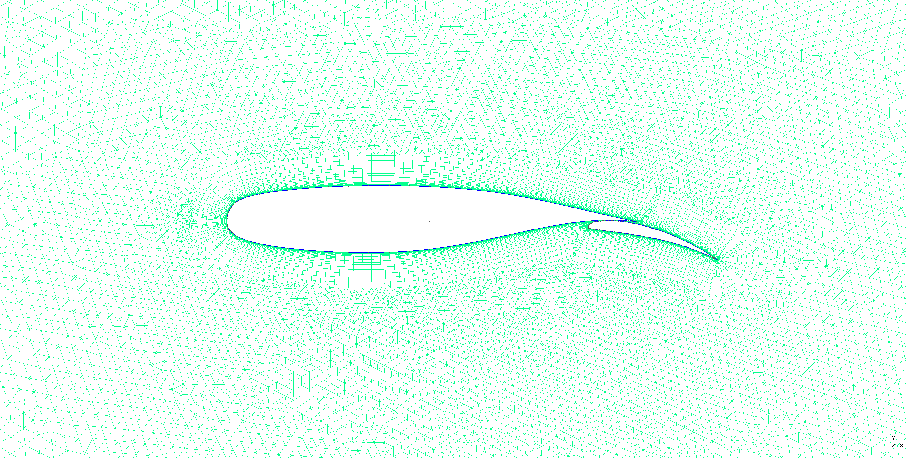

[](https://github.com/cfsengineering/GMSH-Airfoil-2D/actions/workflows/pytest.yml)
[](https://pypi.python.org/pypi/gmshairfoil2d)
[](https://github.com/cfsengineering/GMSH-Airfoil-2D/blob/main/LICENSE)
[](https://github.com/psf/black)

# GMSH-Airfoil-2D

Python tool to genreate 2D unstructured, hybrid and structured mesh around an airfoil with [GMSH](https://gmsh.info/) in one command line.

## Installation

You can install this package from PyPi:

```bash
pip install gmshairfoil2d
```

Or you can clone and install this repository with the following commands:

```bash
git clone https://github.com/cfsengineering/GMSH-Airfoil-2D.git
cd GMSH-Airfoil-2D
pip install -e .
```

## Usage

```text
gmshairfoil2d -h                                    

optional arguments:
  -h, --help                  Show this help message and exit
  --config [PATH]             Path to configuration file (key=value format)
  --save_config [PATH]        Save current configuration to file
  --example_config            Create an example configuration file
  --list                      Display all airfoil available in the database :
                              https://m-selig.ae.illinois.edu/ads/coord_database.html
  --naca [4DIGITS]            NACA airfoil 4 digit
  --airfoil [NAME]            Name of an airfoil profile in the database (database available with
                              the --list argument)
  --airfoil_path [PATH]       Path to custom airfoil .dat file
  --flap_path [PATH]          Path to custom flap .dat file
  --aoa [AOA]                 Angle of attack [deg] (default: 0 [deg])
  --deflection [DEFLECTION]   Flap deflection angle [deg] (default: 0 [deg])
  --farfield [RADIUS]         Create a circular farfield mesh of given radius [m] (default 10m)
  --farfield_ctype            Generate a C-type structured farfield for hybrid meshes
  --box [LENGTHxWIDTH]        Create a box mesh of dimensions [length]x[height] [m]
  --airfoil_mesh_size [SIZE]  Mesh size of the airfoil contour [m] (default 0.01m)
  --ext_mesh_size [SIZE]      Mesh size of the external domain [m] (default 0.2m)
  --no_bl                     Do the unstructured meshing (with triangles), without a boundary
                              layer
  --first_layer [HEIGHT]      Height of the first layer [m] (default 3e-5m) (for bl and structured)
  --ratio [RATIO]             Growth ratio of layers (default 1.2) (for bl and structured)
  --nb_layers [INT]           Total number of layers in the boundary layer (default 35)
  --format [FORMAT]           Format of the mesh file, e.g: msh, vtk, wrl, stl, mesh, cgns, su2,
                              dat (default su2)
  --structured                Generate a structured mesh
  --arg_struc [LxL]           Parameters for the structured mesh [wake length (axis x)]x[total 
                              height (axis y)] [m] (default 10x10)
  --output [PATH]             Output path for the mesh file (default : current dir)
  --ui                        Open GMSH user interface to see the mesh

```

## Configuration Files

Instead of using command-line arguments, you can use configuration files for batch processing. Configuration files use a simple `key=value` format with support for comments.

**Create an example configuration file:**

```bash
gmshairfoil2d --example_config
```

**Use a configuration file:**

```bash
gmshairfoil2d --config my_config.cfg
```

**Override config values with CLI arguments:**

```bash
gmshairfoil2d --config my_config.cfg --aoa 5.0
```

**Save current configuration to file:**

```bash
gmshairfoil2d --naca 0012 --aoa 5.0 --save_config my_config.cfg
```

For more details, see [example/CONFIG_README.md](example/CONFIG_README.md) and ready-to-use examples in [example/EXAMPLES_README.md](example/EXAMPLES_README.md).

## Examples of use

To check all airfoil available in the [database](https://m-selig.ae.illinois.edu/ads/coord_database.html):

```bash
gmshairfoil2d --list
```

For all the following examples, the default chord length is 1 meter.

### Example 1: NACA0012 with circular farfield

To create a circular farfield mesh around a NACA0012 of 10m of radius and see the result with GMSH user interface:

```bash
gmshairfoil2d --naca 0012 --farfield 10 --ui --no_bl
```

Or using config file:

```bash
gmshairfoil2d --config example/example1_naca0012.cfg
```


### Example 2: DAE11 with boundary layer

To create a circular farfield mesh with boundary layer around a Drela DAE11 airfoil (the name in the database is "dae11") of 4m of radius with a mesh size of 0.005m on the airfoil:

```bash
gmshairfoil2d --airfoil dae11 --farfield 4 --airfoil_mesh_size 0.005
```

Or using config file:

```bash
gmshairfoil2d --config example/example2_dae11.cfg
```

### Example 3: E211 in box with angle of attack

To create mesh around an Eppler E211 airfoil (the name in the database is "e211") with an angle of attack of 8 degree in a box of 12x4m (length x height) and save it as a VTK mesh:

```bash
gmshairfoil2d --airfoil e211 --aoa 8 --box 12x4 --format vtk --ui --no_bl
```

Or using config file:

```bash
gmshairfoil2d --config example/example3_e211_box.cfg
```


### Example 4: CH10SM with box and boundary layer

To create a boxed mesh around a Chuck Hollinger CH10SM airfoil (the name in the database is "ch10sm"), using the boundary layer with default parameters (first layer of height 3e-5, 35 layers and growth ratio of 1.2):

```bash
gmshairfoil2d --airfoil ch10sm --ui --box 2x1.4
```

Or using config file:

```bash
gmshairfoil2d --config example/example4_ch10sm_bl.cfg
```


### Example 5: NACA4220 structured mesh

To create a structured mesh around a NACA4220 airfoil with first layer height of 0.01, mesh size of 0.08, wake length of 6, height of 7, and angle of attack of 6 degrees:

```bash
gmshairfoil2d --naca 4220 --airfoil_mesh_size 0.08 --ui --structured --first_layer 0.01 --arg_struc 6x7 --aoa 6
```

Or using config file:

```bash
gmshairfoil2d --config example/example5_naca4220_structured.cfg
```


### Example 6: Custom airfoil from file

To create a mesh around a custom airfoil profile with a deflected flap:

```bash
gmshairfoil2d --airfoil_path tests/test_data/NLR_7301.dat --flap_path tests/test_data/Flap_NLR_7301.dat --deflection 10 --box 4x3 --ui --no_bl
```

Or using config file:

```bash
gmshairfoil2d --config example/example6_custom_airfoil_flap.cfg
```

This example shows how to load custom airfoil and flap profiles from external .dat files and generate a mesh with flap deflection, useful for using proprietary or custom-designed airfoil geometries.
